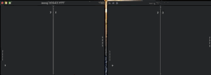

Ping-Pong
=============

-Proyecto comunicación de datos

Antes de compilar es necesario tener la libreria ncurses

Para instalar en linux, ejecuta 

      sudo apt-get install libncurses5-dev libncursesw5-dev

Para compilar, ve al directorio del archivo y ejecuta:

      make

Para ejecutar el servidor       

      
      ./server 7777

Quedará de la siguiente forma 

  

Para ejecutar los clientes 
      
      
      ./pong 127.0.0.1 7777
      
El cliente uno quedará negro, esperando al segundo player, como muestra a continuación

  

Luego de que inicie el player 2, aparecerán ambas pantallas de juego en ambos clientes, pero con el ID correspondiente de cada uno.

Para el player 1 quedará como muestra la siguiente imagen

  

Para el player 2 

  

IMPORTANTE: En el segundo player tocar una tecla de jugador, luego en el primer player y el juego comenzará. 

 

